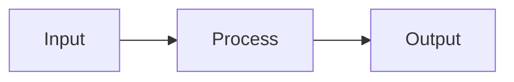

## Problem

One paragraph describing the problem we're solving and why it matters now.

## Proposal

One paragraph describing the proposed solution at a high level.

## How It Works

Brief explanation of the key mechanism.

## Impact

| Area | Impact | Notes |
|------|--------|-------|
| Users | | |
| Engineering | | |
| Operations | | |

## Cost & Timeline

| Phase | Duration | Cost |
|-------|----------|------|
| Phase 1 | | |
| Phase 2 | | |

## Risks

- **Risk 1**: Mitigation strategy
- **Risk 2**: Mitigation strategy

## Ask

What specifically are you asking the reader to approve or decide?
