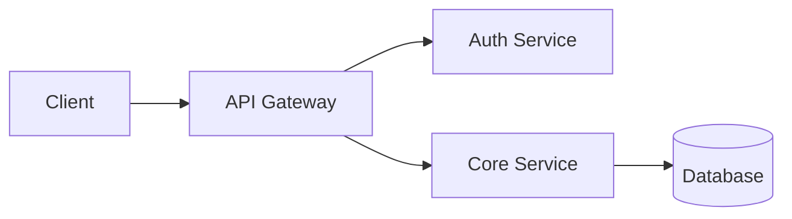
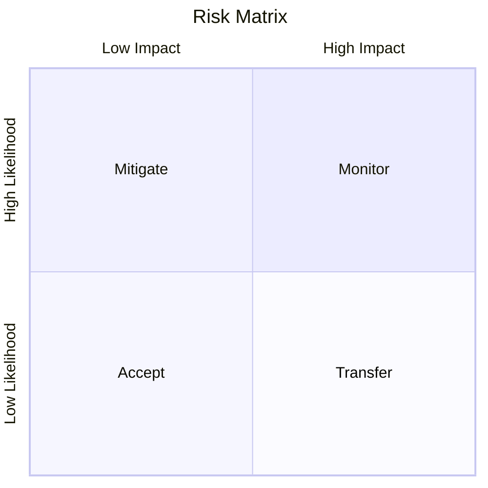

## Table of Contents

---

## System Overview

Brief description of the system being modeled.

## Data Flow

| Source | Destination | Data | Classification |
|--------|-------------|------|----------------|
| Client | API Gateway | Requests | internal |
| API Gateway | Auth Service | Credentials | confidential |
| Core Service | Database | Records | confidential |

## Trust Boundaries

- **External boundary**: Client ↔ API Gateway
- **Internal boundary**: API Gateway ↔ Backend services
- **Data boundary**: Services ↔ Database

## STRIDE Analysis

### Spoofing

| Threat | Impact | Likelihood | Mitigation |
|--------|--------|------------|------------|
| | | | |

### Tampering

| Threat | Impact | Likelihood | Mitigation |
|--------|--------|------------|------------|
| | | | |

### Repudiation

| Threat | Impact | Likelihood | Mitigation |
|--------|--------|------------|------------|
| | | | |

### Information Disclosure

| Threat | Impact | Likelihood | Mitigation |
|--------|--------|------------|------------|
| | | | |

### Denial of Service

| Threat | Impact | Likelihood | Mitigation |
|--------|--------|------------|------------|
| | | | |

### Elevation of Privilege

| Threat | Impact | Likelihood | Mitigation |
|--------|--------|------------|------------|
| | | | |

## Risk Assessment

## Mitigations

| ID | Threat | Mitigation | Status | Owner |
|----|--------|-----------|--------|-------|
| M1 | | | Planned | |

## Residual Risk

Summary of accepted residual risks after mitigations.

## Review History

| Date | Reviewer | Changes |
|------|----------|---------|
| {{date}} | {{author}} | Initial assessment |
